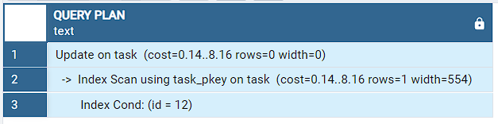

# [Maxbitbot](https://t.me/maxbittg) | Telegram Task Manager Bot

## Overview

The [Maxbitbot | Telegram Task Manager Bot](https://t.me/maxbittg) is a Python-based bot that helps users manage their tasks efficiently on the Telegram platform. Users can register, add tasks, modify them, mark them as complete, and delete them.

## Features

- **User Registration**: Users can register with the bot to create their accounts.
- **Task Management**: Users can add tasks, view their tasks, modify task details, mark tasks as complete, and delete tasks.
- **Finite State Machine (FSM)**: The bot uses FSM to guide users through different steps of task management, providing a smooth and intuitive user experience.
- **Cancellation and Navigation**: Users can cancel ongoing actions or navigate back to the previous step using dedicated commands.
- **Error Handling**: The bot handles errors gracefully and provides informative messages to users in case of invalid input or unexpected issues.

## Dependencies

- **Python 3**: The bot is written in Python 3.
- **aiogram**: A powerful asynchronous library for building Telegram bots.
- **SQLAlchemy**: For interacting with the PostgreSQL database.
- **asyncpg**: An asynchronous PostgreSQL database driver for Python.
- **PostgreSQL**: A relational database used to store user data and task information.

## Project Structure
```bash
maxbitbot/
├── common/
│   └── bot_cmds_list.py          
├── database/
│   ├── sql_query/
│   │   └── create_tables.sql
│   ├── conn.py
│   ├── models.py
│   └── sql_query.py
├── handlers/
│   ├── fsm.py
│   └── private.py
├── kbrds/
│   ├── inline.py
│   └── reply.py
├── messages/
│   ├── choose_login.txt
│   ├── no_register.txt
│   ├── prev_step.txt
│   └── success_register.txt.py
├── .dockerignore
├── .env
├── .gitignore
├── app.py
├── docker-compose.yml
├── Dockerfile
├── README.md
└── requirements.txt
```

## Setup and Usage

1. **Clone the Repository**: Clone this repository to your local machine.
   ```bash
   git clone https://github.com/imartov/maxbitbot.git
   ```

2. Go to the project folder:
```bash
cd maxbitbot
```

3. **Set Up Configuration**: Create a `.env` file and specify the required environment variables such as Telegram bot token, database connection details, etc.
   ```plaintext
   TG_ROKEN=<your-telegram-bot-token>
   DB_USER=<your-postgres-username>
   DB_PASSWORD=<your-postgres-password>
   DB_HOST=<your-postgres-host>
   DB_PORT=<your-postgres-port>
   DB_NAME=<your-postgres-db-name>
   ```

### Docker Compose

4. **Execute the command**:
    ```bash
    docker-compose up
    ```

### Classic approach

4. **Install Dependencies**: Install the required Python dependencies using pip.
   ```bash
   pip install -r requirements.txt
   ```

5. **Start the Bot**: Run the bot application using the following command.
   ```bash
   python app.py
   ```
**Attention!** Before executing the command, make sure that your database is running and its settings correspond to the variables specified in .env.

6. Find the bot in the telegram - [Maxbitbot](https://t.me/maxbittg) bot run the `start` command and enjoy using it!

2. **Interacting with the Bot**: Users can interact with the bot by sending commands and following the bot's prompts for task management.

## Architectural description
This section contains an architectural description of the solution, including a diagram of components and interactions.

### Entities
- **User**. It contains the following properties:  
    - ***chat_id*** - the user's ID in the telegram
    - ***user_name*** - the user name entered
    - ***login*** - a unique logic selected by the user

- **Task**. It contains the following properties:  
    - ***id*** - unique task ID
    - ***chat_id*** - the user's ID in the telegram related to ***User.chat_id***
    - ***name*** - a short task name
    - ***description*** - a longer description of the task

- **Completedtask**. It contains the following properties:  
    - ***id*** - unique task ID
    - ***chat_id*** - the user's ID in the telegram related to ***User.chat_id***
    - ***name*** - a short task name
    - ***description*** - a longer description of the task

### Diagram of components and interactions


## Description of the main classes and functions, their purpose and interaction

The main classes and functions:

### app.main
| Purpose | Interaction |
|:---:|:---:|
| The method contains methods that are called when the bot is launched | dp - `aiogram.Dispatcher()` and bot - `aiogram.Bot()` |

### kbrds.reply.main_kb
| Purpose | Interaction |
|:---:|:---:|
| The variable that forms the main navigation menu | `aiogram.types.ReplyKeyboardMarkup()` and `aiogram.types.KeyboardButton()` |

### kbrds.inline.get_callback_btns
| Purpose | Interaction |
|:---:|:---:|
| The method dynamically generates an inline menu сallback_data is used as an additional mandatory argument | `aiogram.utils.keyboard.InlineKeyboardBuilder()` and `aiogram.types.KeyboardButton()` |

### common.bot_cmds_list.private
| Purpose | Interaction |
|:---:|:---:|
| The variable that forms the list of main commands | `aiogram.types.BotCommand()` |

### handlers.private.command_start_handler
| Purpose | Interaction |
|:---:|:---:|
| The handler receives messages with `/start` command | `aiogram.Router()`, `aiogram.fsm.context.FSMContext()`, `aiogram.types.Message()` |

### handlers.private.menu_cmd
| Purpose | Interaction |
|:---:|:---:|
| This handler receives messages with `/menu` command | `aiogram.Router()`, `aiogram.F`, `aiogram.types.Message()` |

### handlers.fsm.AddUser
| Purpose | Interaction |
|:---:|:---:|
| The class of Finite State Machine object is used when registering a user | `aiogram.fsm.state.StatesGroup()`, `aiogram.fsm.state.State()` |

### handlers.fsm.AddTask
| Purpose | Interaction |
|:---:|:---:|
| The class of Finite State Machine object is used when adding a task | `aiogram.fsm.state.StatesGroup()`, `aiogram.fsm.state.State()` |

## A detailed description of the implemented functionality, including examples of using the bot

This section contains a detailed description of the main application scenario.

### Adding a task


### Updating the task


### Viewing tasks


### The task management


### Cancel or back FSM
At each step when using FSM, the user can enter:  
- `отмена`, which will cancel all the actions performed, or  
- `назад`, which will return the user to the previous step.

## Description of the database structure and the SQL queries used
### Models:
- **User**. It contains the following properties:  
    - ***chat_id*** - Integer, Primary Key
    - ***user_name*** - String(100)
    - ***login*** - String(100), Unique

- **Task**. It contains the following properties:  
    - ***id*** - Integer, Serial, Primary Key
    - ***chat_id*** - Integer, foreign key of ***User.chat_id***
    - ***name*** - String(256)
    - ***description*** - Text

- **Completedtask**. It contains the following properties:  
    - ***id*** - Integer, Serial, Primary Key
    - ***chat_id*** - Integer, Foreign Key of ***User.chat_id***
    - ***name*** - String(256)
    - ***description*** - Text

### SQL queries:
- **extract the chat_id**:
    - method: `database.sql_query.check_exist_chat_id`
    - query: `SELECT chat_id FROM users WHERE chat_id = <value>`
    - plan:  
    

- **extract the login**:
    - method: `database.sql_query.check_exist_login`
    - query: `SELECT login FROM users WHERE login = <value>`
    - plan:  
    

- **insert a user**:
    - method: `database.sql_query.insert_user`
    - query: `INSERT INTO users(chat_id, user_name, login) VALUES(<value>, <value>, <value>)`  
    - plan:  
    

- **insert a task**:
    - method: `database.sql_query.insert_user`
    - query: `INSERT INTO task(chat_id, name, description) VALUES(<value>, <value>, <value>)`  
    - plan:  
    

- **update the task**:
    - method: `database.sql_query.update_task`
    - query: `INSERT INTO task(chat_id, name, description) VALUES(<value>, <value>, <value>)`  
    - plan:  
    

- **select tasks**:
    - method: `database.sql_query.select_tasks`
    - query: `SELECT id, name FROM task WHERE chat_id = <value>`  
    - plan:  
    

- **select the task**:
    - method: `database.sql_query.select_detail_tasks`
    - query: `SELECT id, name, description FROM task WHERE id = <vakue>`  
    - plan:  
    

- **insert row to completedtask**:
    - method: `database.sql_query.complete_task`
    - query: `INSERT INTO completedtask(chat_id, name, escription) VALUES(<value>, <value>, <value>)`  
    - plan:  
    

- **delete row from task**:
    - method: `database.sql_query.delete_task`
    - query: `DELETE FROM task WHERE id = '1'`  
    - plan:  
    


## Contributing

Contributions are welcome! If you'd like to contribute to the project, please follow these steps:

1. Fork the repository.
2. Create a new branch (`git checkout -b feature-new-feature`).
3. Make your changes and commit them (`git commit -am 'Add new feature'`).
4. Push to the branch (`git push origin feature-new-feature`).
5. Create a new pull request.

## License

The MIT License (MIT)
Copyright (c) 2024 Alexandr Kozyrev, https://github.com/imartov

Permission is hereby granted, free of charge, to any person obtaining a copy
of this software and associated documentation files (the "Software"), to deal
in the Software without restriction, including without limitation the rights
to use, copy, modify, merge, publish, distribute, sublicense, and/or sell
copies of the Software, and to permit persons to whom the Software is
furnished to do so, subject to the following conditions:

The above copyright notice and this permission notice shall be included in
all copies or substantial portions of the Software.

THE SOFTWARE IS PROVIDED "AS IS", WITHOUT WARRANTY OF ANY KIND, EXPRESS OR
IMPLIED, INCLUDING BUT NOT LIMITED TO THE WARRANTIES OF MERCHANTABILITY,
FITNESS FOR A PARTICULAR PURPOSE AND NONINFRINGEMENT. IN NO EVENT SHALL THE
AUTHORS OR COPYRIGHT HOLDERS BE LIABLE FOR ANY CLAIM, DAMAGES OR OTHER
LIABILITY, WHETHER IN AN ACTION OF CONTRACT, TORT OR OTHERWISE, ARISING FROM,
OUT OF OR IN CONNECTION WITH THE SOFTWARE OR THE USE OR OTHER DEALINGS IN
THE SOFTWARE.

## Contact

For any inquiries or issues, please contact:  
alexandr.kosyrew@mail.ru  
[Telegram](https://t.me/alr_ks)